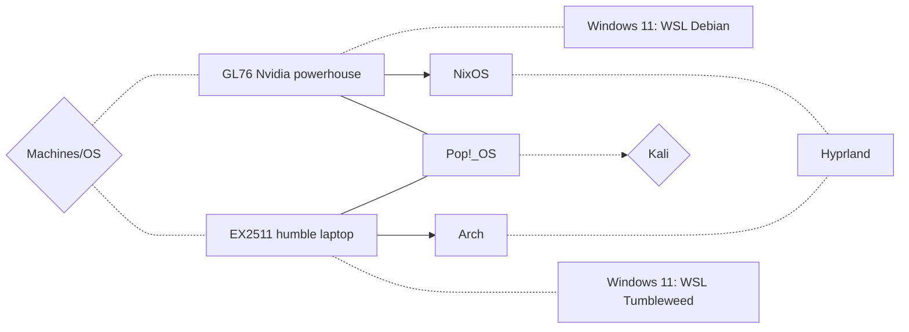

# dotfiles

<!-- TODO

- Tweak waybar >> https://github.com/hyper-dot/Arch-Hyprland
  - Add screenshots
- Dependencies
  - ok as is?
 -->


## Screenshots 

> WIP

<!--

https://github.com/lauroro/hyprland-dotfiles
https://github.com/gasech/hyprland-dots

1. NixOS desktop: tiling & floating
   1. neofetch
   2. steam
   3. codium

2. PopOS
   1. Neofetch
   2. Codium


 -->


## *NIX environment

- See my [docs](/docs/) for a **multiboot walkthrough** going over dependencies and tweaks

| Component     | Software
| :--           | :--
| **Browser**   | Brave
| **Shell**     |<span style="font-weight: normal; text-decoration: none;">zsh + ohmyzsh</span>
| **Terminal**  | alacritty + tmux
| **Font**      | FiraCode Nerd Font
| **DE/WM**     | Cosmic & Hyprland
| **Editor**    | codium & nvim (LSPs + DAPs)
| **Misc**      | bat btop cheat exa fzf lf ripgrep tldr
| **Hyprland**  | hypr mako rofi swaybg thunar waybar


## Boxes setup

- In addition my Android runs [*Termux*](https://termux.dev/en/) and my Pentium IV dual-boots *Windows XP* and [*Arch_32*](https://archlinux32.org) btw




<!--

```mermaid

= Win 11 Home = WSL Debian
= Win 11 Pro = WSL Tumbleweed

```
 -->
