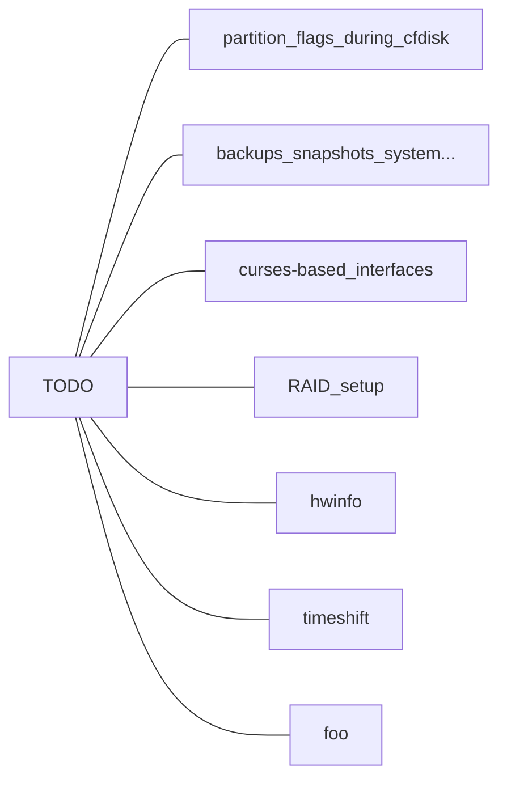

# Arch Linux


- [Arch Linux](#arch-linux)
  - [documentation](#documentation)
  - [live installation](#live-installation)
  - [post-install config](#post-install-config)


> - **NOTE 1:** Arch installation demonstrated with and without bootloader (see [#multiboot](/docs/))
> - **NOTE 2:** this (UEFI) installation is for my intel machine with Nvidia hybrid graphics, so adapt it for VMs or else
> - **NOTE 3:** different DE/WM solutions are outlined right after the base-install
> - **NOTE 4:** our actual setup is the **Hyprland** WM (Wayland)
> - **NOTE 5:** no encryption atm

```md
if
  error: zlib: signature from Levente Polyak is unknown trust
  File /var/cache/pacman/pkg/zlib-x.pkg.tar.zst is corrupted (invalid or corrupted package (PGP signature))
then
  pacman -Syy
  pacman -S archlinux-keyring
  pacman -Syu
  # https://www.linode.com/community/questions/22299/arch-upgrade-via-pacman-syu-fails-due-to-error-pam-signature-is-unknown-trust
```

---


<!--


 -->


## documentation

- Base install
  - [Install Arch Linux in VirtualBox](https://gist.github.com/thomasheller/5b9b18917bbaabceb4f629b793428ee2) -- gist
  - @DistroTube: [Arch Linux Installation Guide](https://www.youtube.com/watch?v=PQgyW10xD8s) -- YouTube
  - @MentalOutlaw: [Arch Linux Installation Guide](https://www.youtube.com/watch?v=rUEnS1zj1DM) -- YouTube
  - @ArchWiki: [Arch Installation Guide](https://wiki.archlinux.org/title/Installation_guide), [VirtualBox Guest Additions](https://wiki.archlinux.org/title/VirtualBox/Install_Arch_Linux_as_a_guest)
  - @ArchWiki: [General recommendations: config after install](https://wiki.archlinux.org/title/General_recommendations), [Users and groups](https://wiki.archlinux.org/title/Users_and_groups#User_management), [Sudo](https://wiki.archlinux.org/title/Sudo)
- DE/WM
  - @ILHAM: [Arch Linux EFI Installation Guide](https://www.youtube.com/watch?v=C1KqdAsgVAo), [Installation and Getting Started With SWAY](https://www.youtube.com/watch?v=2t_v-zBbwbo) -- YouTube <!-- SWAY // [r/unixporn](https://www.reddit.com/r/unixporn/comments/128eco5/sway_i_love_wayland/), [dotfiles](https://github.com/aspectsides/dotfiles)-->
  - KDE --> [@tuxinit: minimal install](https://tuxinit.com/minimal-kde-plasma-install-arch-linux/) article, [minimal install (UEFI & MBR)](https://github.com/XxAcielxX/arch-plasma-install#xorg--gpu-drivers) -- gist
- **Hyprland**
  - https://wiki.hyprland.org/Getting-Started/Installation
  -  `rofi`, `dunstrc`: [ericmurphyxyz](https://github.com/ericmurphyxyz/dotfiles)
  - `hypr`: [hypr-dot](https://github.com/hyper-dot/Arch-Hyprland), [lauroro](https://github.com/lauroro/hyprland-dotfiles)
  - `waybar`: [gasech](https://github.com/gasech/hyprland-dots)
- btrfs
  - ...


## live installation

```yaml
# If VM...
Settings:
  System:
    Enable EFI: yes
  Display:
    Video Memory: max
    # Enable 3D Acceleration: yes
```

<!-- MOCKS
```bash
# sed -i '/s/#en_GB.UTF/en_GB.UTF/' /etc/locale.gen
# sed -i '/#en_GB.UTF/s/^#//' /etc/locale.gen
# echo "LANG=en_GB.UTF-8" > /etc/locale.conf
# hwclock --systohc

# echo -e "127.0.0.1\t\t\tlocalhost" >> /etc/hosts
# sed -i 's/GRUB_TIMEOUT=5/GRUB_TIMEOUT=0/' /etc/default/grub

# localectl list-x11-keymap-layouts
# sudo localectl set-x11-keymap es || echo -e "\nsetxkbmap es" >> $HOME/.bashrc

# $ sudo pacman -S firefox glow mdcat mdp
# $ sudo pacman -S noto-fonts-emoji otf-font-awesome otf-firamono-nerd ttf-jetbrains-mono-nerd
# $ sudo pacman -S gnome-themes-extra lxappearance papirus-icon-theme
# $ yay -S win11-icon-theme-git kripton-theme-git
# $ yay -S ttf-ms-win11-auto

# i3
# $ sudo pacman -S nitrogen rofi polybar <file-manager>
# $ sudo sed -i 's/#greeter-session=example-gtk-gnome/greeter-session=lightdm-gtk-greeter/' /etc/lightdm/lightdm.conf


# https://github.com/MarianArlt/sddm-sugar-dark
sudo pacman -S qt5-svg qt5-quickcontrols2 qt5-graphicaleffects
# Brave >> opendesktop.org/p/1272122
sudo tar -xzvf ~/Downloads/sugar-dark.tar -C /usr/share/sddm/themes
nvim /usr/lib/sddm/sddm.conf.d/default.conf
    # [General] DisplayServer=wayland
    # [Theme] Current=sugar-dark


cheat   # Y
ln -sf ~/dotfiles/.config/cheat/conf.yml ~/.config/cheat/
mkdir ~/.config/cheat/cheatsheets/wip
rmdir ~/.config/cheat/cheatsheets/personal
ln -s ~/dotfiles/.config/cheat/cheatsheets/personal ~/.config/cheat/cheatsheets/

# $ rustup update           # << eww:rustup
# $ pacman -S acpi          # likely remove

    # # $ sudo pacman -S deno webkit2gtk


# localectl list-x11-keymap-layouts
# sudo localectl set-x11-keymap es || echo -e "\nsetxkbmap es" >> $HOME/.bashrc

```
 -->


 - Check hardware specs

```bash
lscpu | less
free -h
```

- Wifi...

```bash
iwctl
device list
# device wlan0 set-property Powered on
station wlan0 scan
station wlan0 get-networks
station wlan0 connect MOVISTAR_C600
```

- Manage disks and install a base system

```bash
# Set Spanish keyboard
loadkeys es

# Verify the internet connection
ip link

# Config WiFi if necessary
sudo nmtui
# $ nmcli radio wifi                            # see status
# $ nmcli radio wifi off                        # turn on/off

# To ssh from another machine:
# $ systemctl enable --now sshd && passwd root
# To ssh into a VM, ensure networking is set to Bridged Network.
```
```bash
# See mountpoints, partitions and filesystems, manage EFI partitions
lsblk -f
efibootmgr
    # $ efibootmgr -b 000X -B

# Create and mount new partitions
    # Below we provide baremetal on the left and VM on the right
    # If multiboot with existing boot partition, mount it and only create the / partition

cfdisk /dev/nvme0n1                                     # /dev/sda
    # GPT: 1024MiB EFI, 4GiB Swap, 200GiB Linux         << bare-metal multiboot
    # DOS: 512MiB bootable, 2GiB Swap, maxGiB Linux     << VM

mkfs.vfat -F32 /dev/nvme0n1p1                           # /dev/sda1
mkfs.ext4 /dev/nvme0n1p3                                # /dev/sda3
mkswap /dev/nvme0n1p2 && swapon /dev/nvme0n1p2          # /dev/sda2

mount /dev/nvme0n1p3 /mnt                               # /dev/sda3
mkdir -p /mnt/boot/efi                                  # /mnt/boot
mount /dev/nvme0n1p1 /mnt/boot/efi                      # /dev/sda1 /mnt/boot


# Improve live ISO pacman performance --> uncomment Misc option "ParallelDownloads=5"
vim /etc/pacman.conf

# Update the keyring if necessary
pacman -Sy archlinux-keyring
# pacman-key --init
# pacman-key --populate archlinux

# Install the base system -- exclude irrelevant packages (Nvidia if VM, bootloader if NixOS multiboot...)
pacstrap /mnt linux linux-firmware base base-devel networkmanager neovim neofetch git \
              linux-headers intel-ucode nvidia-open-dkms sof-firmware alsa-firmware \
              grub os-prober efibootmgr wget

# Save the filesystem table
genfstab -U /mnt >> /mnt/etc/fstab

# Chroot into the new system
arch-chroot /mnt
```
- Prep the new installation

```bash
# Set keyboard layouts, locales and time
echo "KEYMAP=es" > /etc/vconsole.conf
nvim /etc/locale.gen
    # uncomment en_US.UTF line
locale-gen
ln -sf /usr/share/zoneinfo/Europe/Madrid /etc/localtime

# Set networking and pacman tweaks
systemctl enable NetworkManager
echo "ArchBox" > /etc/hostname
nvim /etc/hosts
    # append "127.0.0.1         localhost"

nvim /etc/pacman.conf
    # uncomment Misc options: Color VerbosePkgLists ParallelDownloads=10 -- add ILoveCandy
    # uncoment both the [multilib] and Include lines to enable 'multilib' repo for Steam
```

```bash
# Install and configure a bootloader if necessary

grub-install --efi-directory=/boot/efi --bootloader-id=GRUB --target=x86_64-efi     # UEFI
# $ grub-install /dev/sda                                                           # BIOS

nvim /etc/default/grub
    # uncomment OS_PROBER line at the end for easy multiboot
    # optionally change GRUB_TIMEOUT and the DEFAULT menu entry
    # # add 'nvidia_drm.modeset=1' at GRUB_CMDLINE_LINUX_DEFAULTS

# To multiboot other distros or Windows (its bootloader) later on either drive:
# $ mkdir /mnt/popos
# $ mount /dev/nvme0n1p4 /mnt/popos
# $ mkdir /mnt/win11
# $ mount /dev/nvme1n1p1 /mnt/win11

grub-mkconfig -o /boot/grub/grub.cfg

# Install a GRUB theme, for example:
# $ wget -O - https://github.com/shvchk/poly-dark/raw/master/install.sh | bash
```

```bash
# Create user
useradd -m -g users -G wheel username
passwd username
passwd root
EDITOR=nvim visudo
    # uncomment top %wheel ALL=(ALL:ALL) ALL

# Finish the install
exit
umount -R /mnt
shutdown now
```

```yaml
Ensure bootable OS:
  Remove installer ie. prioritized boot entry:
    - baremetal: remove Ventoy flashdrive
    - virtual machine: via GUI or run `eject /dev/sr0` upon boot
    - Power on
  If baremetal multiboot check BIOS/UEFI settings:
    - all machines: Boot order --> GRUB before Windows
    # - EX2511: SecureBoot ON, Restore SB, Select UEFI as trusted (../GRUB/grubx64.efi), SB OFF
    # - EX2511: if Proxmox... HDD2 > EFI - proxmox > grubx64.efi
  Further boot problems: run `efibootmgr` from the Arch live ISO
```


## post-install config

- Update system and prepare environment

```bash
# Update the system
sudo pacman -Syu
neofetch

# Ensure layout and time will be OK
sudo localectl set-keymap es
sudo timedatectl set-ntp on

# Set up Yay <-- `nvim /etc/makepkg.conf` for tweaks
git clone https://aur.archlinux.org/yay.git
cd yay && makepkg -si
cd .. && rm -rf yay

# Install web browser and prep cheatsheets -- consider $ keepassxc
yay -S brave-bin cheat-bin --cleanmenu=false --diffmenu=false   # 2) noto-fonts

# Install fave software
sudo pacman -S alacritty bat bottom btop eza fzf git-delta grc inetutils less lf \
               man man-pages nmap openssh python-pip python ripgrep tldr tmux \
               ttf-firacode-nerd ttf-cascadia-code-nerd unzip zoxide zsh

# Update tldr and vanilla cheatsheets
tldr --update
yes | cheat   # Y and Y
```

```bash
# If VM: $ sudo pacman -S virtualbox-guest-utils && sudo systemctl enable vboxservice

# If baremetal and Nvidia:
lspci -v | rg -A1 -e VGA -e 3D \
  && sudo pacman -S nvtop nvidia-settings gwe

# If WM, tweak them fonts:
sudo nvim /usr/share/fontconfig/conf.avail/69-unifont.conf
    # :%s/FreeMono/FiraCode Nerd Font/

# If baremetal and WM, create relevant mountpoints:
sudo pacman -S ntfs-3g progress udiskie udisks2

sudo mkdir /mnt/usb
sudo mount /dev/sdx /mnt/usb
sudo umount /mnt/usb
sudo eject /dev/sdx

sudo mkdir /mnt/ntfs
sudo mount -t ntfs-3g /dev/sdxY /mnt/ntfs
# sudo cp -r /mnt/ntfs/path/to/origin ~/path/to/destination & \
#  && progress --monitor --pid $!
sudo umount /mnt/ntfs
sudo eject /dev/sdx

# https://wiki.archlinux.org/title/udisks:
    # $ udisksctl unmount -b /dev/sdb1 && udisksctl power-off -b /dev/sdb

# https://wiki.hyprland.org/Nvidia:
    # $ sudo nvim /etc/mkinitcpio.conf      # add MODULES=( nvidia nvidia_modeset nvidia_uvm nvidia_drm )
    # $ sudo mkinitcpio --config /etc/mkinitcpio.conf --generate /boot/initramfs-custom.img
```

- Install a DE/WM, if needed enter `Ctrl+Alt+F{2-9}` for a new TTY 

```bash
# Hyprland
sudo pacman -S hyprland qt5-wayland qt6-wayland qt5ct xdg-desktop-portal-hyprland
yay -S rofi-lbonn-wayland-git rofi-power-menu rofi-emoji
sudo pacman -S mako polkit-kde-agent swaybg waybar    # 2) pipewire-jack && 2) wireplumber
yay -S wev swayidle swaylock-effects

# Certain packages could be replaced with:
# $ yay -S eww-wayland dunst hyprpaper

# Optionally install a display manager (sddm) and config its theme
# $ sudo pacman -S sddm && sudo systemctl enable sddm
# $ ls /usr/share/sddm/themes && sudo nvim /usr/lib/sddm/sddm.conf.d/default.conf
    # [Theme] Current=maldives...

sudo pacman -S alsa-utils pamixer pipewire-alsa pipewire-audio pipewire-pulse
# $ sudo nvim /usr/share/alsa-card-profile/mixer/profile-sets/multiple.conf
    # https://wiki.archlinux.org/title/PipeWire#Simultaneous_output_to_multiple_sinks_on_the_same_sound_card
        # $ pactl info && aplay -l && alsamixer && sudo dmesg | rg audio
        # $ journalctl --boot | grep -e wireplumber -e pipewire
        # $ systemctl --user list-unit-files | rg wire

sudo pacman -S brightnessctl bluez bluez-utils blueman
    # $ systemctl --user enable bluetooth

sudo pacman -S thunar thunar-volman thunar-archive-plugin gvfs file-roller tumbler
```

```bash
# i3
sudo pacman -S devilspie dmenu feh i3-gaps i3status lightdm lightdm-gtk-greeter
               light-locker picom xdg-utils brightnessctl pamixer pulseaudio

sudo systemctl --global mask pulseaudio.socket
pamixer --unmute --set-volume 80

sudo systemctl enable lightdm
sudo nvim /etc/lightdm/lightdm.conf
    # uncomment and change greeter-session=example... for lightdm-gtk-greeter

# $ sudo mkdir /usr/share/wallpapers \
#    && sudo cp ~/dotfiles/img/* /usr/share/wallpapers \
#    && sudo sed -i 's/#background=/background=\/usr\/share\/wallpapers\/er_nokstella.jpg/' /etc/lightdm/lightdm-gtk-greeter.conf

# $ ln -s ~/dotfiles/.config/i3 ~/.config/i3

yay -S lxappearance rose-pine-gtk-theme papirus-icon-theme thunar
# lxappearance...

# https://unix.stackexchange.com/questions/150853/how-to-set-gtk-icon-theme-in-i3
```

```bash
# Gnome
sudo pacman -S gdm
sudo systemctl enable gdm
sudo pacman -S gnome gnome-tweaks # gnome-browser-connector
  # gnome-tweaks: scaling_factor==0.75, middle_click_paste==off
  # gnome keybinds: launch_web_browser==Super+B, custom_alacritty==Super+T, custom_nautilus==Super+F, custom_codium==Super+C
yay -S gnome-browser-connector-git
  # gnome_extensions: panel_free by fthx,
sudo pacman -Syu xdg-desktop-portal-wlr grim  # virtualbox docker mariadb-clients
sudo pacman -Syu pipewire-alsa pipewire-jack pipewire-pulse     # REMOVES pulseaudio etc -- because YouTube not playing lol

# Kde
sudo pacman -S plasma-desktop sddm
sudo systemctl enable sddm

# Xfce
sudo pacman -S xfce4 lightdm lightdm-gtk-greeter
sudo systemctl enable lightdm

# LXQt
sudo pacman -S lxqt breeze-icons sddm
sudo systemctl enable sddm
```


- Post DE/WM

```bash
# Set up SSH auth for Github
ssh-keygen -t ed25519 -C "my@email.com"     # skip
cat ~/.ssh/id_25519.pub
    # github.com > profile settings > add New SSH
ssh -T git@github.com                       # yes

# Install oh-my-zsh
sh -c "$(curl -fsSL https://raw.githubusercontent.com/ohmyzsh/ohmyzsh/master/tools/install.sh)"

# Clone & symlink them dotfiles
git clone git@github.com:pabloqpacin/dotfiles.git

rm .zshrc
ln -s ~/dotfiles/.zshrc ~
ln -s ~/dotfiles/.gitconfig ~

ln -s ~/dotfiles/.config/lf ~/.config
ln -s ~/dotfiles/.config/bat ~/.config
ln -s ~/dotfiles/.config/btop ~/.config
ln -s ~/dotfiles/.config/nvim ~/.config
ln -s ~/dotfiles/.config/tmux ~/.config
ln -s ~/dotfiles/.config/alacritty ~/.config

# i3 config
ln -s ~/dotfiles/.devilspie ~/
ln -s ~/dotfiles/.config/i3 ~/.config

# Hyprland dotfiles
ln -s ~/dotfiles/.config/cava ~/.config
ln -s ~/dotfiles/.config/hypr ~/.config
ln -s ~/dotfiles/.config/mako ~/.config
ln -s ~/dotfiles/.config/rofi ~/.config
ln -s ~/dotfiles/.config/waybar ~/.config
```

```bash
# Install tmux plugin manager
git clone --depth 1 https://github.com/tmux-plugins/tpm ~/.tmux/plugins/tpm
tmux    # $ C-b + I --> Install plugins

# Install node
curl -o- https://raw.githubusercontent.com/nvm-sh/nvm/v0.39.3/install.sh | bash
nvm install node
  # $ npm install --global live-server

# Set up neovim
sudo pacman -S deno webkit2gtk
yay -S nvim-packer-git --cleanmenu=false --diffmenu=false 
cd ~/.config/nvim && nvim lua/pabloqpacin/packer.lua
# $ :so && :PackerSync && :PackerCompile && :MasonUpdate
  # Fix Peek
```

```bash
# Install desktop applications
yay -S vscodium-bin || sudo pacman -S code
sudo pacman -S discord steam    # 2) lib32-nvidia-utils
sudo pacman -S spotify-launcher spotifyd
    # $ yay -Si librespot mpd

# Install lab stuff
# yay -S zenmap
sudo pacman -S wireshark-qt \
  && sudo usermod -aG wireshark username

sudo pacman -S virtualbox virtualbox-guest-iso              # 2) virtualbox-host-dkms
    # $ ls /usr/lib/virtualbox/additions/VBoxGuestAdditions.iso
    # $ sudo nvim /etc/default/grub >> add itb=off ...
```

<!--
- Overwrite old HDD with zeroes

```bash
# Mount it and erase its current partitions aye
# sudo mkdir /mnt/old_hdd
    # sudo mount /dev/sdc /mnt/old_hdd
# sudo cfdisk /dev/sdc
# sudo mkfs.ext4 /dev/sdc
# sudo mount /dev/sdc /mnt/old_hdd

# No partitions mounted: erase the HDD with zeros
sudo dd if=/dev/zero of=/dev/sdc bs=4M status=progress
```
 -->

```bash
# Pictures and img
yay -S grimshot feh
# $ yay -S w3m-imgcat
# $ sudo pacman -S flameshot xdg-desktop-portal xdg-desktop-portal-wlr
```

---

<!-- # bash + zsh .. profile env

> IDEA: common aliases & functions where applicable (DRY code)

```bash
curl oh-my-bash
cd dotfiles && git mv .bashrc .bashrc.old
mv ~/.bashrc ~/dotfiles
ln -s ~/dotfiles/.bashrc ~/
ga .bashrc
```

```bash
sudo pacman -Syu inetutils  # hostname command

sudo pacman -Syu docker && \
  sudo systemctl enable docker && \
  sudo usermod -aG docker $USER

yay -S ttf-cascadia-code-nerd
```

---


# SUPER WIP (solid-zsh)

- Docker

```bash
sudo pacman -S docker
sudo usermod -aG docker $USER

# docker pull portainer/portainer
# docker run -d -p 9000:9000 --name portainer --restart always -v /var/run/docker.sock:/var/run/docker.sock portainer/portainer
# xdg-open http://localhost:9000

### DOCKERIZE ALL HE STUFF BELOW!!!
```

- Mariadb

```bash
# https://wiki.archlinux.org/title/MariaDB

sudo pacman -S mariadb
mariadb-install-db --user=mysql --basedir=/usr --datadir=/var/lib/mysql; # ls /etc/my.cnf.d/server.cnf
  # root@localhost == no pass ... need to be system's root user
  # mysql@localhost == no pass ... need to be system's mysql user

sudo systemctl enable --now systemctl
sudo mariadb-secure-installation
  # Current pass for root: <enter>
  # Switch to unix_socket auth: <enter>
  # Change root pass: <enter>                 # changeme
  # Remove anon users: <enter>
  # Disallow root login remotely: <enter>
  # Remove test database and access to it: <enter>
  # Reload privilege tables now: <enter>

mariadb -u root -p
  # CREATE DATABASE wordpress;
  # CREATE USER wordpress@localhost IDENTIFIED BY 'some_pass';
  # GRANT ALL PRIVILEGES ON wordpress.* TO wordpress@localhost;
  # flush privileges;
```

```bash
sudo systemctl enable --now nginx
xdg-open http://localhost   # /usr/share/nginx/html/index.html
```
```bash
# sudo pacman -S nginx mariadb php-fpm    # mysql ... pacman -Ss "php-" | grep "sql"

# sudo pacman wordpress   # https://wiki.archlinux.org/title/Wordpresshttps://wiki.archlinux.org/title/Wordpresshttps://wiki.archlinux.org/title/Wordpresshttps://wiki.archlinux.org/title/Wordpresshttps://wiki.archlinux.org/title/Wordpress

# sudo mariadb-secure-installation
```

> FOO THIS SHIT; LET?S DOCKERIZE -->


- Docker

```bash
sudo pacman -Syu docker docker-buildx
```

- Misc

```bash
sudo pacman -S qbittorrent
yay -S onlyoffice-bin

sudo pacman -S inxi
sudo inxi -Fz

yay -S dnslookup-bin
```

```bash
yay -S powershell-bin --cleanmenu=false --diffmenu=false
mkdir $HOME/.local/bin && \
 curl -s https://ohmyposh.dev/install.sh | bash -s -- -d $HOME/.local/bin
ln -s ~/dotfiles/.config/powershell ~/.config
```

