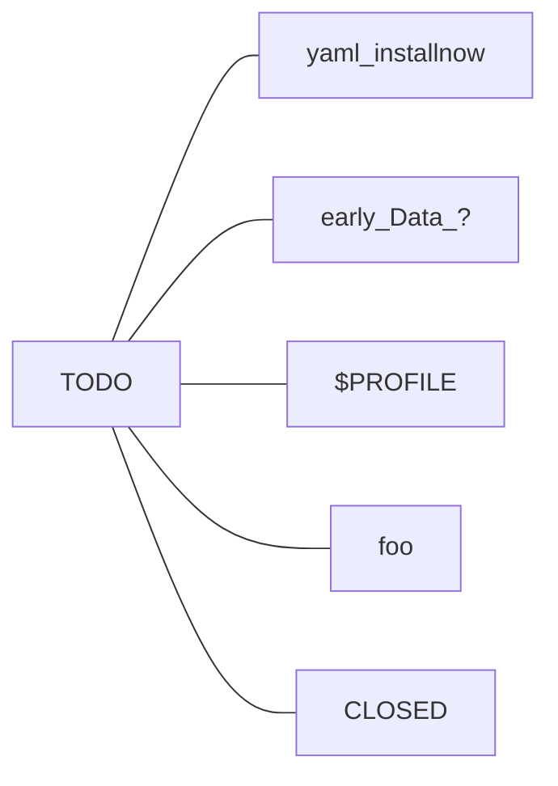

# Windows 11 - Home/Pro

> - **NOTE 1:** WSL-focused installation
> - **NOTE 2:** mind the pre-installed PWSH ISE application
> 


<!--

 -->
<!-- TODO: [ansible](https://www.ansible.com/for/windows) -->


## documentation

<details>

- **PowerShell**
  - @LearnMicrosoft: [PWSH 7.3](https://learn.microsoft.com/en-us/powershell/scripting/windows-powershell/ise/introducing-the-windows-powershell-ise?view=powershell-7.3)
  - @LearnMicrosoft: [Install PWSH 7](https://learn.microsoft.com/en-us/powershell/scripting/install/installing-powershell-on-windows?view=powershell-7.3) && [Update PWSH from 5 to 7](https://learn.microsoft.com/en-us/powershell/scripting/whats-new/migrating-from-windows-powershell-51-to-powershell-7?view=powershell-7.3)
      - [winget](https://learn.microsoft.com/en-us/windows/package-manager/winget/): Windows Package Manager service interface to {discover, install, upgrade, remove, and configure} applications
      - MSI package: either via [SCCM System Center Config Manager](https://learn.microsoft.com/en-us/mem/configmgr/apps/) or CLI <!-- `msiexec.exe /package PowerShell-7.3.4-win-x64.msi /quiet ADD_EXPLORER_CONTEXT_MENU_OPENPOWERSHELL=1 ADD_FILE_CONTEXT_MENU_RUNPOWERSHELL=1 ENABLE_PSREMOTING=1 REGISTER_MANIFEST=1 USE_MU=1 ENABLE_MU=1 ADD_PATH=1` -->
      - [Microsoft Store](https://learn.microsoft.com/en-us/windows/msix/desktop/desktop-to-uwp-behind-the-scenes)
      - ZIP package
  - @LearnMicrosoft: [PWSH Help System](https://learn.microsoft.com/en-us/powershell/scripting/learn/ps101/02-help-system?view=powershell-7.3) && [PWSH Dynamic Help](https://learn.microsoft.com/en-us/powershell/scripting/learn/shell/dynamic-help?view=powershell-7.3)
  - @LearnMicrosoft: [Creating PWHS Profiles](https://learn.microsoft.com/en-us/powershell/scripting/learn/shell/creating-profiles?view=powershell-7.3)
  - @LearnMicrosoft: [VSCode Integration](https://learn.microsoft.com/en-us/powershell/scripting/dev-cross-plat/vscode/using-vscode?view=powershell-7.3)

| PWSH              | 7                                 | 5
| ---               | ---                               | ---
|  Executable       | pwsh.exe                          | powershell.exe
| `$PROFILE`        | $HOME\Documents\PowerShell        | $HOME\Documents\WindowsPowerShell
| `$PSModulePath`   | $env:ProgramFiles\PowerShell\7    | $env:WINDIR\System32\WindowsPowerShell\v1.0


- **WSL**


</details>


---

## live installation


- Ventoy boot


```yaml
# Install Now
Language to install: en (US)
Time and currency format: es (ES)
Keyboard or input method: Spanish (Spain)

License: 'I don't have a product key'
OS: Windows 11 Pro N || Windows 11 Home

Type of installation: Customised == Install Windows only (advanced)
Disk Management:
  # Drive 0: HDD for backups
  # Drive 1: 2TB NVMe for Linux  
  # Drive 2: 1TB NVMe for Windows 11  
  Drive 2:
    # - Delete every partition
    - Unallocated Space: New 
      P1: 100MB System EFI
      P2: 16MB MSR Reserved
      P3: 200GB Primary NTFS    # 204900 MB
      P4: 750GB Unallocated     # We'll format/mount it later
      P5: 10GB DriverCD
Install: Partition 3 (Disk 2)

# Remove Ventoy / installation media
```

- First boot

<!--
# Windows Microsoft Account:
RESTORE:
  - [2023-06-18] GL76
  - [2022-08-24] QUEVEDOPABLO-S4
 -->


```yaml
# Setup
Region: Spain
Keyboard: Spanish
Device name: Win11Box

Set up: Personal use
# MS Account: no@thankyou.com
MS Account: myaccount@gmail.com     # LICENCED
Restore: Set up as new device
Create PIN: ...

Location: yes
Find Device: no
Diagnostics: Required
Inking: no
Tailored experience: no
Advertising ID: no
Customise experience: Skip

Use Phone from PC: Skip
OneDrive: Next
Microsoft 365: Decline
100 GB Cloud: Decline
```

---

## post-install config

- System update and basic desktop settings

```powershell
# LAB-ORIENTED APPROACH against the GUI options below -- not recommended tbh

# Change execution policy temporarily
Get-ExecutionPolicy -List
Set-ExecutionPolicy Unrestricted -Scope Process # [A]

# Install PSWindowsUpdate module
Install-Module PSWindowsUpdate  # Install NuGet from PSGallery
Import-Module PSWindowsUpdate
Install-WindowsUpdate -AcceptAll
Restart-Computer -Force
```


<!-- SETTINGS
- # System: Activation: Windows is activated with a digital licence linked to your Microsoft account
# Network and internet: !!
- Windows Security: driver issue for Core Isolation: Memory integrity (igdkmd64.sys)
- # For devs: Powershell: Change execution policy to allow local PowerShell scripts to run without signingl. Require signing for remote scripts.
 -->


```yaml
# Start Menu: Uninstall --> Instagram Messenger Netflix Prime_Video

# System settings
Settings:
    Windows Update:
        - Check for updates --> Download and install all
        # Advanced options: Optional updates: Driver updates: yes
    System:
        Power and battery: Energy Recommendations (!Power mode .. Balanced)
        # Storage: Advanced storage settings: ...
    Privacy and security:
        Windows Security: keep it green!!
        For developers:
            # - Developer mode
            # - Powershell: DON'T
            - File Explorer: everything ON
            - Default terminal: Windows Terminal
    Apps:
        Installed apps: Uninstall --> Clipchamp Family MS_News Solitaire Weather
        Startup:
         - ON:  Spotify
         - OFF: MS_Edge MS_Teams Steam Discord
    Personalisation:
        Theme: Glow
        Colors: Purple_shadow && Show accent colour on title bars and window borders
        Background: 'Choose a photo'
        Lock screen: Windows spotlight
        Start: Folders --> add Settings
        Taskbar:
            - Automatically hide the taskbar
            - Hide --> all (Search Task_view Widgets Chat)

# MS Store
Library: Get updates --> Update all

# Disk Management
Disk 2: Unallocated 750GB --> New Simple Volume:
    'D:' NTFS Data .. Enable file and folder compression
    # https://learn.microsoft.com/en-us/windows/win32/vds/volume-object
```


- PowerShell 7

```powershell
# Start the preinstalled PowerShell
$PSVersionTable.PSVersion   # 5.1 atm
$PSModulePath               # {TODO: ???}
$PROFILE                    # C:\Users\pquev\OneDrive\documents.MSI\WindowsPowerShell\Microsoft.PowerShell_profile.ps1  # {OJO -- location can't be found}

# Update winget and install PWSH 7
winget -v \
 && winget --help \
 && winget --info

winget update && winget upgrade --all
winget install --id Microsoft.Powershell --source winget
    # $ Allow? YES -- C:\Users\pquev\AppData\Local\Temp\WinGet\Microsoft.PowerShell.7.2.4.0\PowerShell-7.3.4-win-x64.msi
```
```powershell
# Start the latest PowerShell

    # Get-Help -Name -Get-Help    # -Full -Detailed -Examples -Online -Parameter NOUN - ShowWindow    | Out-GridView
    # Update-Help
    # Update-Help -UICulture en_US
    
```


- WSL

- Terminal Config

<!-- > see [foo](#) -->


- Installing software